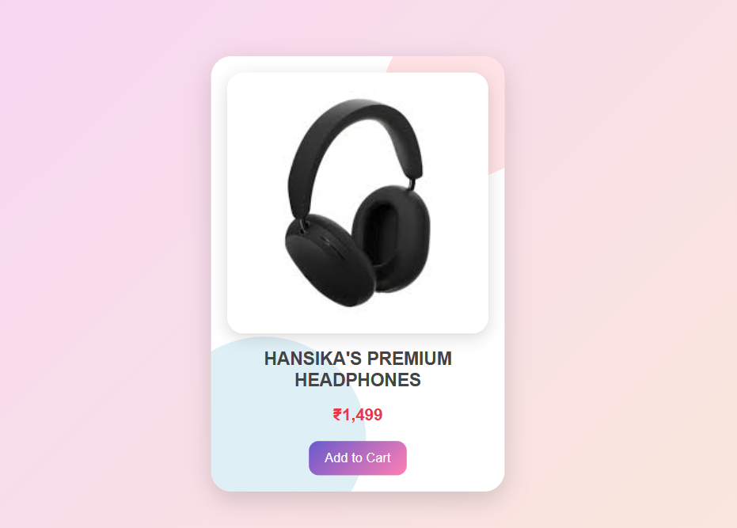

SAIKET SYSTEMS TASK 2

Product Card – Modern HTML & CSS UI Component
A sleek, responsive Product Card interface designed using HTML & CSS.
This project demonstrates beginner-friendly UI development, clean code practices, and simple design layout principles.

FEATURES
Clean & modern UI
Includes product image, title, price & button
Styled using external CSS
Beginner-friendly project
Fast & lightweight
Easy to customize

FOLDER STRUCTURE
hans/
│── card.html       
│── card.css        
│── card.png         
│── README.md      

TECHNOLOGIES USED
HTML5
CSS3

WHAT I LEARNED
How to structure HTML for UI components
Linking CSS to HTML pages
Inserting and positioning images
Creating simple product layouts
Improving visual aesthetics using CSS

USE CASES

This component can be used for:
Shopping websites
Product catalog sections
Card layouts
Practice projects
Portfolio UI components

